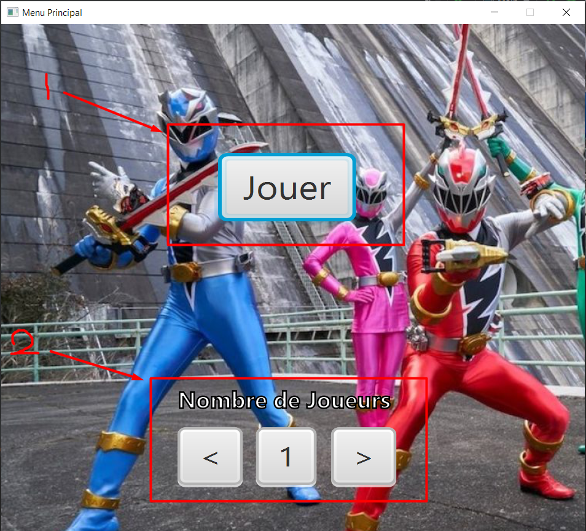
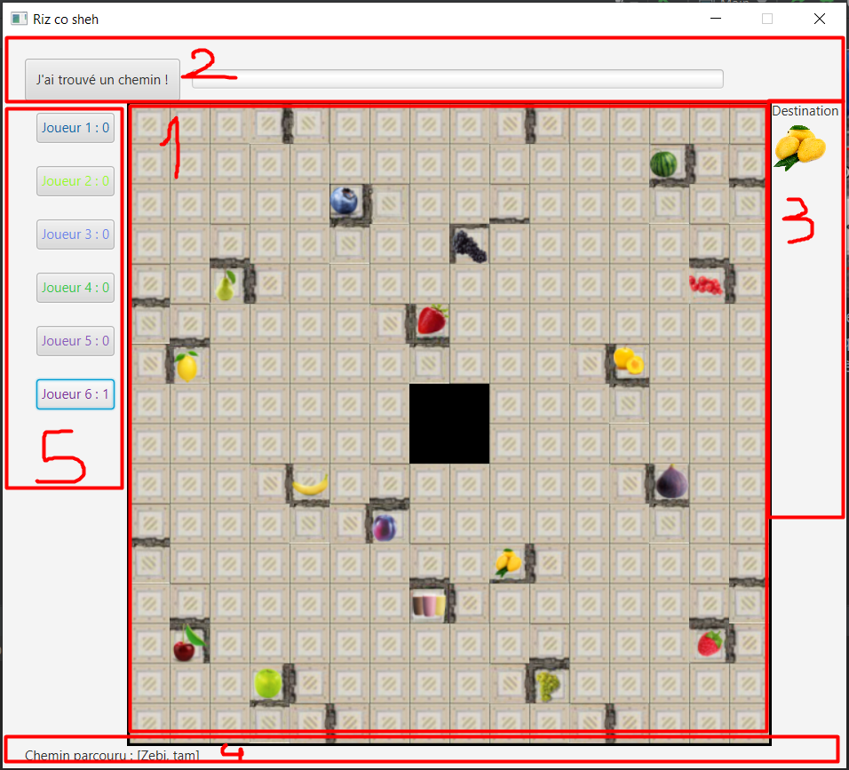
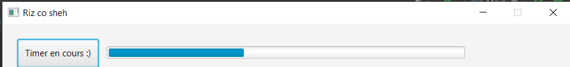
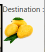
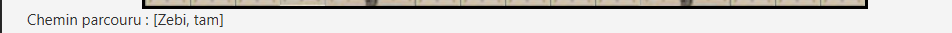
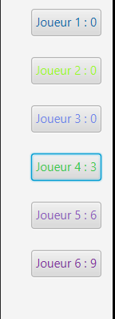
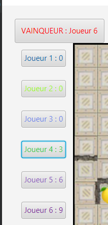

# Fruit Rangers : Manuel de jeu
#-------------------------------------------
 
# Règles du jeu
##Générales
- S'amuser.
- Ne pas prendre en considération les différents bugs.

- Déplacer les robots afin d’atteindre la case objectif en un minimum de coups.

- Token de destination : il indique la case objectif du plateau à atteindre et la couleur du Robot qui doit l’atteindre. Un Smoothie multicolore peut être atteint par n’importe quel Robot.

- Tous les joueurs cherchent avec leurs yeux un moyen d’amener le Robot sur case objectif en respectant les règles de déplacement.
- Le 1er joueur qui pense avoir trouvé un chemin annonce en combien de coups et lance le timer.
- Quand le timer est écoulé, le joueur pensant avoir le nombre de coups minimum peut jouer.
- Lorsqu'un joueur remporte une manche, il clique sur son nom de personnage pour compter le score.
- Quand les 17 manches ont été jouées, le joueur avec le plus de manches remportées gagne.

##Déplacement
- Un Robot se déplace horizontalement ou verticalement sans pouvoir s’arrêter jusqu’à rencontrer un obstacle (bord du plateau, mur, plaque centrale ou Robot)
- Une fois arrêté, un Robot peut repartir quand il veut dans toutes les directions possibles.
- Tous les Robots sont déplaçables et sont utilisés comme obstacles mobiles.
- Chaque déplacement compte pour un coup.

# Fonctionnement

##Menu principal

1: Bouton Jouer -> Lance le jeu \
2: Nombre de Joueurs -> Cliquez sur la flèche de gauche pour baisser le nombre de joueurs et cliquez sur la flèche de droite pour augmenter le nombre de joueurs

##Fenêtre de jeu

###1 : Plateau de jeu

C'est sur ce plateau que se déroule les fondamentaux du jeu Fruit Rangers. Le but ici est d'amener votre robot de la couleur du token de destination vers le fruit indiqué. 

###2 : Timer de réflexion

Lorsque l'un d'entre vous pense avoir trouvé un chemin pour arriver au token de destination, il faut cliquer sur le bouton pour déclencher le timer. A la fin de celui-ci, le joueur pensant avoir le moins de coup pour y arriver peut jouer.

###3 : Token de destination

Token de destination où le robot associé à la couleur doit se rendre. Le token se met à jour à chaque nouvelle manche.

###4 : Chemin parcouru

Ici s'affiche le chemin parcouru par le joueur afin de ne rien manquer de son parcours !

###5 : Liste des joueurs et points

Dans cet encadré se situe la liste des joueurs. Lorsque l'un d'eux remporte la manche, il faut cliquer sur son numéro associé afin de pouvoir compter les points.

##Condition de victoire

Lorsque toutes les manches auront été réalisées, soit 17 manches au total, alors s'affichera le nom du grand vainqueur à la place du bouton prévu pour le timer.